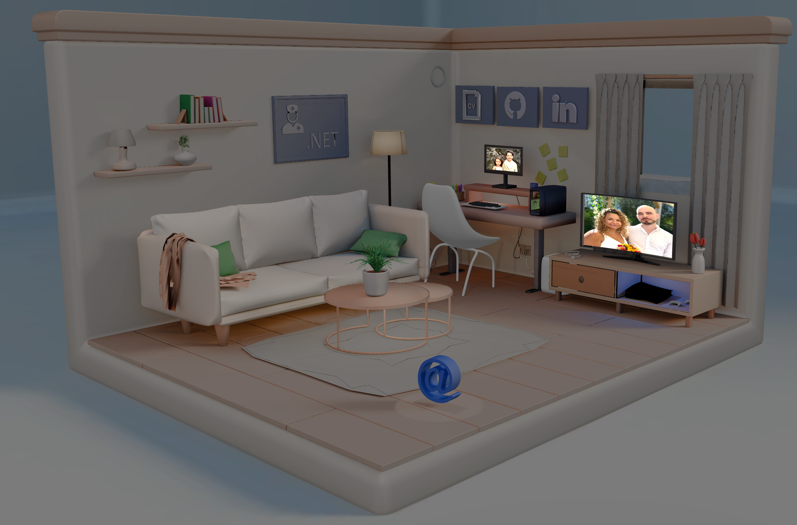

# Interactive 3D Portfolio

## 📋 About the Project

An **immersive 3D portfolio experience** built with Next.js and Three.js. Visitors can explore the space, click on interactive objectsor get in touch. All within a rendered 3D environment.

The project emphasizes **Scandinavian design principles**: minimalist aesthetics, natural color palettes, and functional simplicity. Every interaction is crafted with smooth GSAP animations to create an engaging user experience.

## Core Features

- **🎮 Interactive 3D Room** - Fully explorable isometric space with clickable objects
- **📱 Responsive Design** - Seamless experience across desktop, tablet, and mobile
- **🎨 Aesthetics** - Clean, minimalist design with natural color tones
- **✉️ Integrated Contact Form** - Netlify Forms with client-side Zod validation
- **🎬 Smooth Animations** - GSAP-powered transitions and hover effects
- **⚡ Optimized Performance** - Compressed DRACO models and WebP textures
- **♿ Accessibility First** - Semantic HTML structure

## Technologies Used

- **Next.js** - React framework with App Router
- **Three.js** - 3D graphics and WebGL rendering
- **TypeScript** - Type-safe development
- **GSAP** - Animation library
- **Tailwind CSS** - Utility-first styling
- **Blender** - 3D modeling and scene creation
- **Zod** - Schema validation
- **Netlify Forms** - Form handling
- **React Hot Toast** - Notification system

## Key Interactions

1. **Click & Drag** - Rotate the camera to explore different angles
2. **Scroll/Pinch** - Zoom in and out of the scene
3. **Click Objects** - Interact with buttons to open modals or navigate
4. **Escape/Click Away** - Close modals and return to exploration

## Developed By

**Johannes Brannelid**  
Fullstack .NET Developer

- 🌐 [Portfolio](https://jbrannelid.com/)
- 💼 [LinkedIn](https://www.linkedin.com/in/johannes-brannelid/)
- 🐙 [GitHub](https://github.com/JBrannelid)

## Shout Outs & Credits

### Inspiration

- **[Sooah's Room-Folio](https://www.sooahs-room-folio.com/)** - Major inspiration for the 3D room portfolio concept

### Icons & Graphics

- **[Lucide React](https://lucide.dev/guide/packages/lucide-react)** - Icon library used throughout the UI
- **[SVG Repo](https://www.svgrepo.com/)** - High-quality SVG resources

## License

This project is personal portfolio work. Feel free to get inspired, but please create your own unique version! 🎨
